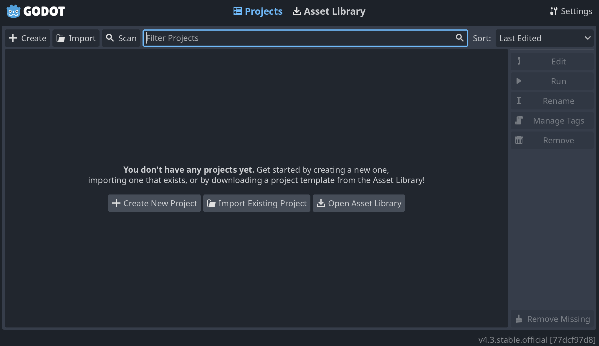
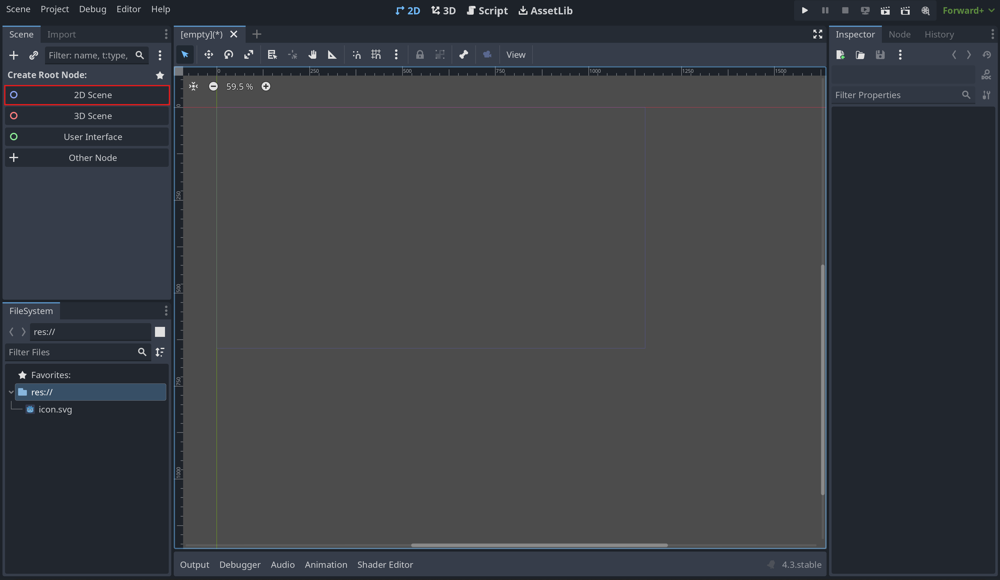
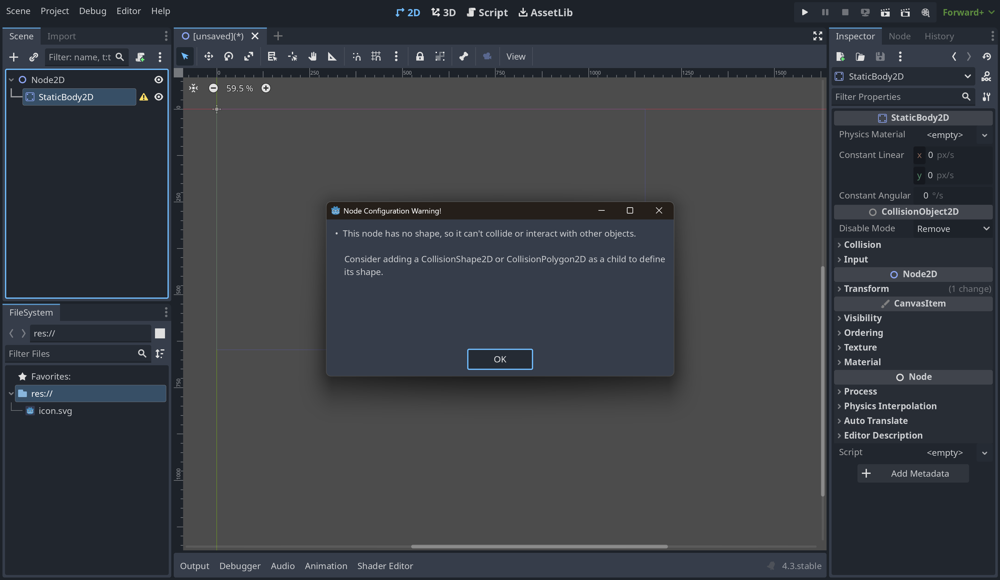

# Godot Workshop

This workshop will introduce you to the Godot game engine. Godot is a free and open-source game engine that is perfect for beginners and experienced developers alike. It is easy to use, yet powerful enough to create complex games.

## Table of Contents

- [0. Prerequisites](#0-prerequisites)
- [1. Getting Started](#1-getting-started)
- [2. Controls](#2-controls)
- [3. Creating a Scene](#3-creating-a-scene)
- [4. Creating a Player](#4-creating-a-player)
    - [Scripting](#scripting)
- [5. Camera following the player](#5-camera-following-the-player)
- [6. HUD](#6-hud)
- [7. Add more things !](#7-add-more-things-)
- [8. Exporting your game](#8-exporting-your-game)
- [9. Conclusion](#9-conclusion)

## 0. Prerequisites

Before you start this workshop, you should have Godot installed on your computer. You can download Godot from the [official website](https://godotengine.org/download).

Get the latest version.

## 1. Getting Started

To start this workshop, open Godot and create a new project. Click on the **"Create"** button.

It will open a new window where you can choose the project name and location. You can let the **Rendering Mode** to **Forward+** as this is the most efficient and advanced rendering mode for PC.

To finish the creation of the project, click on the **"Create & Edit"** button.

## 2. Controls

You will notice that you have a 3D viewport, a 2D viewport, and a script editor. You can switch between the viewports by clicking on the tabs at the top of the screen. For this workshop, we will be focusing on the 2D viewport.

To navigate the 2D viewport, you can use the following controls:

- **Left Mouse Button**: Selection Box
- **Middle Mouse Button**: Move Camera
- **Right Mouse Button**: Context Menu
- **Mouse Wheel**: Zoom In/Out

## 3. Creating a Scene

In Godot, everything is a node. Nodes can be anything from a simple sprite to a complex physics object, and they can have children nodes. To begin making a scene using 2D, click on **"2D Scene"**. This will create a root node of type Node2D.

If you want your scene to have both 3D and 2D (for example a 3D platformer with UI elements), the root node should be of type **Node**.

Now that we have a root Node3D, we can add more nodes to it.

To start, let's add a wall to the scene. Right-click on the Root Node2D and select **"Add Child Node"**. Then, search for **"StaticBody2D"** and add it to the scene.

You will notice that the **StaticBody2D** node has a warning icon. You can click on the warning icon to see what the problem is.

This is because the **StaticBody2D** node requires a collision shape to work properly. To add a collision shape, right-click on the **StaticBody2D** node and select **"Add Child Node"**. Then, search for **"CollisionShape2D"**.

You will see that the warning icon has disappeared from the **StaticBody2D** node. But now the **CollisionShape2D** node has a warning icon. This is because we need to provide a shape for the collision shape to use.

To add a shape to the collision shape, click on the **"Shape"** property in the **Inspector** panel. Then, click on **"New RectangleShape2D"**.

You should now add a sprite to your wall, so it becomes visible when playing. You can either use a custom sprite or the default godot.svg sprite added by default when creating a new Godot project. Right click your **StaticBody2D** again and click **"Add Child Node"**, but this time add a Sprite2D node, you can then drag click your texture from the FileSystem directly into the Texture field of the sprite2D, you should see your texture appear then.

## 4. Creating a Player

    This is where we stop holding your hand, you're gonna have to start looking up how do to things the EPITECH way from here :3

Now that we have made a wall, we should make a player that you can control with the keyboard.

Start by creating a **CharacterBody2D**, you're gonna see a warning again, what have we learned to do here?

Then, add a **Sprite2D** to your player so we can see it.

### Scripting

Here comes the fun part, programming!

Right click the **CharacterBody2D** node of your player and click "Attach Script" -> "Create".

2 Functions are present by default, **_ready()** and **_process(delta)**. What do they do?

*Tip: Godot has an offline documentation, you can access it by pressing F1 in the editor or CTRL + Clicking on a function or class name.*

Using the **_physics_process(delta)** function and the **Input** system of Godot, make the player move around and collide with the wall you created before.

## 5. Camera following the player

Add a **Camera2D** node and make it follow the player when it moves around.

## 6. HUD

Using a **Label** control node, display on the screen an FPS count updating every frame.

    Look into the CanvasLayer node

## 7. Add more things !

All you did is sufficient to cover the basics of Godot, with all you've learned, you should be able to add more features to your game. Here is some ideas:
- Enemies
- Collectibles
- A score system
- A timer
- Obstacles
- A main menu, pause menu, game over screen
- A level system

Or anything you can think of!

## 8. Exporting your game

Once you're done with your game, you can build it for the platform of your choice. Click on **"Project"** -> **"Export"**, click on **"Add"** to add a Preset, then select the platform you want to export to.

Based on the platform you selected, you will have to follow the instructions to export your game. You can find them on the [official documentation](https://docs.godotengine.org/en/stable/getting_started/workflow/export/exporting_projects.html).

## 9. Conclusion

Congratulations! You have completed the Godot workshop. You should now have a basic understanding of how to create a game in Godot. Feel free to experiment with different features and create your own games.

You can find more tutorials and resources on the [official Godot Documentation](https://docs.godotengine.org/en/stable/index.html).
