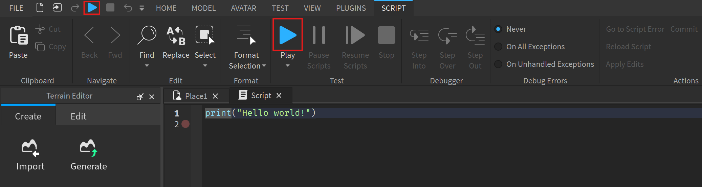

# Roblox User Group

This workshop will teach the basics of Roblox Studio and how to create your first game.

## Table of Contents

- [1. Getting started](#1-getting-started)
  - [1.1. Make an Account](#11-make-an-account)
  - [1.2. Download](#12-download)
  - [1.3. Create from template](#13-create-from-template)
- [2. The Explorer](#2-the-explorer)
    - [2.1. Workspace](#21-workspace)
    - [2.2. Players](#22-players)
    - [2.3. Replicated First](#23-replicated-first)
    - [2.4. Replicated Storage](#24-replicated-storage)
    - [2.5. Server Script Service](#25-server-script-service)
    - [2.6. Starter GUI](#26-starter-gui)
    - [2.7. Starter Player](#27-starter-player)
      - [2.7.1. Starter Character Scripts](#271-starter-character-scripts)
      - [2.7.2. Starter Player Scripts](#272-starter-player-scripts)- [2.7. Starter Player](#27-starter-player)
      - [2.7.1. Starter Character Scripts](#271-starter-character-scripts)
      - [2.7.2. Starter Player Scripts](#272-starter-player-scripts)
- [3 Lua (Luau)](#3-lua-luau)
  - [3.1. Hello, World!](#31-hello-world)
  - [3.2. Variables](#32-variables)
  - [3.3. Strings](#33-strings)

## 1. Getting started

### 1.1. Make an Account
Start by making a Roblox account. Go to [Roblox](https://www.roblox.com/) and click on the "Sign Up" button. Fill in the required information and click on the "Sign Up" button.

### 1.2. Download
Download Roblox Studio from the [Roblox website](https://www.roblox.com/create). If you already installed Roblox before, Roblox Studio should be installed on your computer.

### 1.3. Create from template
Log in to Roblox Studio and create a new place from the "Baseplate" template.

## 2. The Explorer

On the right side of your screen, you will see the "Explorer" window. This window shows all the objects in your game. You can use the Explorer to select objects and change their properties.

Each object in this "Explorer" window is called an "Instance". Instances are the building blocks of Roblox games. They can be anything from a part to a script.


### 2.1. Workspace

The "Workspace" is the main container for all the objects that are physically in the game space. You can add objects to the Workspace by clicking on the "+" button next to it.

### 2.2. Players ≠ Characters

The "Players" instance contains all the players present in the game. It contains information about the player, such as their name, score and other properties. The "Players" instance is not the same as the "Character" instances, which represent the player's physical body in the game.

### 2.3. Replicated First

The "ReplicatedFirst" instance makes all its stored objects be replicated to the client before any other instances. This is useful for loading screens and other UI elements that need to be shown to the player before the game starts.

### 2.4. Replicated Storage

The "ReplicatedStorage" is an instance that is replicated to the client and the server. This is useful for storing objects that need to be accessed by both the client and the server, such as scripts and GUI elements.

### 2.5. Server Script Service

The "ServerScriptService" is an instance that is only replicated to the server. This is useful for storing scripts that should only run on the server, such as scripts that handle game logic and data storage.

### 2.6. Starter GUI

The "StarterGui" is an instance that contains all the GUI elements that are shown to the player when they join the game. This is useful for storing GUI elements that should/could be shown to the player at all times, such as health bars and scoreboards.

### 2.7. Starter Player

#### 2.7.1. Starter Character Scripts

The "StarterCharacterScripts" is an instance that contains scripts that are run when a player's character is created. This is useful for setting up the player's character, such as adding animations and controlling the character's behavior.

#### 2.7.2. Starter Player Scripts

The "StarterPlayerScripts" is an instance that contains scripts that are run when a player joins the game. This is useful for setting up the player's GUI, such as interacting with a health bar or a scoreboard.

# 3 Lua (Luau)

Lua is a lightweight, high-level, multi-paradigm programming language designed primarily for embedded use in applications. Lua is cross-platform, since the interpreter is written in ANSI C, and has a relatively simple C API.

Here, Roblox Studio uses a modified version of Lua called Luau. Luau is a statically-typed language that is designed to be fast and efficient. It is used to create scripts that control the behavior of objects in a Roblox game.

## 3.1. Hello, World!

To start, we will create a script that displays "Hello, World!" in the console.

In the Explorer, click on the "+" next to "Workspace" and select "Script".

This will open a new tab with the default example:

```lua
print("Hello, World!")
```

Click the "Play" button at the top of the screen to start the game.



Look at the console at the bottom of the screen to see the "Hello, World!" message.


## 3.2. Variables

In Lua, variables don't need types, like Python, they are always declared using the `local` keyword, unless you want them to be global, which is not recommended (we will use "Variable" objects insted).

Here is an example of how to declare a variable in Lua:

```lua
  local myVariable = "Hello, World!"
  print(myVariable)
```

Give it a try!


## 3.3. Strings

In Lua, Strings can be created by enclosing the text in single or double quotes. Here are some examples:

```lua
  local myString1 = "Hello, World!"
  local myString2 = 'Hello, World!'
```

Strings can be concatenated using the `..` operator.

```lua
  local myString1 = "Hello, "
  local myString2 = "World!"
  local myString3 = myString1 .. myString2
  print(myString3)
```
