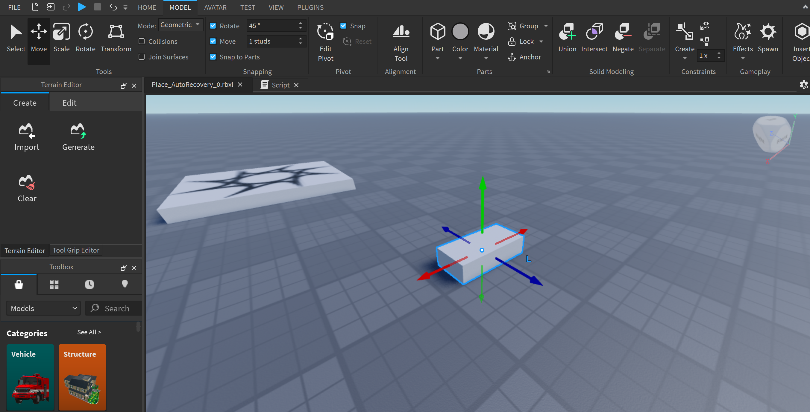

# Roblox User Group

This workshop will teach the basics of Roblox Studio and how to create your first game.

## Table of Contents

- [1. Getting started](#1-getting-started)
  - [1.1. Make an Account](#11-make-an-account)
  - [1.2. Download](#12-download)
  - [1.3. Create from template](#13-create-from-template)
- [2. The Explorer](#2-the-explorer)
    - [2.1. Workspace](#21-workspace)
    - [2.2. Players](#22-players)
    - [2.3. Replicated First](#23-replicated-first)
    - [2.4. Replicated Storage](#24-replicated-storage)
    - [2.5. Server Script Service](#25-server-script-service)
    - [2.6. Starter GUI](#26-starter-gui)
    - [2.7. Starter Player](#27-starter-player)
      - [2.7.1. Starter Character Scripts](#271-starter-character-scripts)
      - [2.7.2. Starter Player Scripts](#272-starter-player-scripts)- [2.7. Starter Player](#27-starter-player)
      - [2.7.1. Starter Character Scripts](#271-starter-character-scripts)
      - [2.7.2. Starter Player Scripts](#272-starter-player-scripts)
- [3 Lua (Luau)](#3-lua-luau)
  - [3.1. Hello, World!](#31-hello-world)
  - [3.2. Variables](#32-variables)
  - [3.3. Strings](#33-strings)
- [4 Objects](#4-objects)
  - [4.1. Part](#41-part)
- [5 Events](#5-events)
  - [5.1. On Touched](#51-on-touched)
  - [5.2. Kill Brick](#52-kill-brick)
    - [5.2.1. Pretty Kill Block](#521-pretty-kill-block)
- [6 Conclusion](#6-conclusion)

## 1. Getting started

### 1.1. Make an Account
Start by making a Roblox account. Go to [Roblox](https://www.roblox.com/) and click on the "Sign Up" button. Fill in the required information and click on the "Sign Up" button.

### 1.2. Download
Download Roblox Studio from the [Roblox website](https://www.roblox.com/create). If you already installed Roblox before, Roblox Studio should be installed on your computer.

### 1.3. Create from template
Log in to Roblox Studio and create a new place from the "Baseplate" template.

## 2. The Explorer

On the right side of your screen, you will see the "Explorer" window. This window shows all the objects in your game. You can use the Explorer to select objects and change their properties.

Each object in this "Explorer" window is called an "Instance". Instances are the building blocks of Roblox games. They can be anything from a part to a script.


### 2.1. Workspace

The "Workspace" is the main container for all the objects that are physically in the game space. You can add objects to the Workspace by clicking on the "+" button next to it.

### 2.2. Players ≠ Characters

The "Players" instance contains all the players present in the game. It contains information about the player, such as their name, score and other properties. The "Players" instance is not the same as the "Character" instances, which represent the player's physical body in the game.

### 2.3. Replicated First

The "ReplicatedFirst" instance makes all its stored objects be replicated to the client before any other instances. This is useful for loading screens and other UI elements that need to be shown to the player before the game starts.

### 2.4. Replicated Storage

The "ReplicatedStorage" is an instance that is replicated to the client and the server. This is useful for storing objects that need to be accessed by both the client and the server, such as scripts and GUI elements.

### 2.5. Server Script Service

The "ServerScriptService" is an instance that is only replicated to the server. This is useful for storing scripts that should only run on the server, such as scripts that handle game logic and data storage.

### 2.6. Starter GUI

The "StarterGui" is an instance that contains all the GUI elements that are shown to the player when they join the game. This is useful for storing GUI elements that should/could be shown to the player at all times, such as health bars and scoreboards.

### 2.7. Starter Player

#### 2.7.1. Starter Character Scripts

The "StarterCharacterScripts" is an instance that contains scripts that are run when a player's character is created. This is useful for setting up the player's character, such as adding animations and controlling the character's behavior.

#### 2.7.2. Starter Player Scripts

The "StarterPlayerScripts" is an instance that contains scripts that are run when a player joins the game. This is useful for setting up the player's GUI, such as interacting with a health bar or a scoreboard.

# 3 Lua (Luau)

Lua is a lightweight, high-level, multi-paradigm programming language designed primarily for embedded use in applications. Lua is cross-platform, since the interpreter is written in ANSI C, and has a relatively simple C API.

Here, Roblox Studio uses a modified version of Lua called Luau. Luau is a statically-typed language that is designed to be fast and efficient. It is used to create scripts that control the behavior of objects in a Roblox game.

## 3.1. Hello, World!

To start, we will create a script that displays "Hello, World!" in the console.

In the Explorer, click on the "+" next to "Workspace" and select "Script".

This will open a new tab with the default example:

```lua
print("Hello, World!")
```

Click the "Play" button at the top of the screen to start the game.


Look at the console at the bottom of the screen to see the "Hello, World!" message.


## 3.2. Variables

In Lua, variables don't need types, like Python, they are always declared using the `local` keyword, unless you want them to be global, which is not recommended (we will use "Variable" objects insted).

Here is an example of how to declare a variable in Lua:

```lua
  local myVariable = "Hello, World!"
  print(myVariable)
```

Give it a try!


## 3.3. Strings

In Lua, Strings can be created by enclosing the text in single or double quotes. Here are some examples:

```lua
  local myString1 = "Hello, World!"
  local myString2 = 'Hello, World!'
```

Strings can be concatenated using the `..` operator.

```lua
  local myString1 = "Hello, "
  local myString2 = "World!"
  local myString3 = myString1 .. myString2
  print(myString3)
```

*Try it!*

# 4 Objects

In Roblox, objects are different type of instances that can be added to the game. Here, we will add an physical object to the game.

## 4.1. Part

A **"Part"** is a basic object that can be added to the game. It can be used to create walls, floors, and other objects in the game.

To add a part to the game, click on the **"+"** next to **"Workspace"** in the Explorer and select part.

To move the part in the game, click on the **"Move"** tool in **"Model"** tab and drag the part to the desired location.

Here what you should see:



For more confort, you can press **"F"** to focus on the part. The camera will be centered on it and you can move around it.

You can also change the scale and rotation of the part by clicking on the **"Scale"** and **"Rotate"** tools in the "Model" tab.

***For any movement, rotation or scaling, you can hold "Shift" to make more precise changes.***

To try that, we will make a thin square at the ground. Make it however you like as long as you can walk on it.

Now, we will change the color of the part. To do that, click on the **"Part"** in the Explorer, you will see the **"Properties"** window below the **"Explorer"**. In the "Properties" window, you can change the properties of the "Part", such as its color, size, and position.

We will change the color of the "Part" to red (Any red you like).

Here is what you should see:


# 5 Events

In Roblox, events are used to trigger actions when certain conditions are met. Here, we will create an event that triggers when the player touches the part.

## 5.1. On Touched

The **"Touched"** event is triggered when a part comes into contact with another part. This event can be used to detect when a player touches a part in the game.

For that, let's create a script **inside** the part. (You will find the "+" next to any object in the Explorer)

Once the script is created, we will first get the part that the script is in. To do that, we will use the `script.Parent` property.

```lua
local part = script.Parent
```

Here, `script` refers to the script itself, and `Parent` refers to the object that the script is inside. It is it's parent in the hierarchy.

Now, we can create the **"Touched"** event for our part.

```lua
part.Touched:Connect(function(hit: BasePart)
    print("Touched!")
end)
```

Here, `part.Touched` refers to the **"Touched"** event that every part has. The `:Connect()` function is used to connect the event to a **"Callback"** function. This callback is called whenever the event is triggered.

The `function(hit: BasePart)` is the callback function that is called when the part is touched. The `hit` parameter is the part that touched the part. The `: BasePart` is a type annotation that specifies that the `hit` parameter is a part, like in langauges like TypeScript or Python.

So now, when this part is touched by any other part, the message "Touched!" will be printed in the console.

Now, we will need to get the player's **Character** (the player's physical body in the game) and its **Humanoid** (the object that controls the player's behavior).

*For now, we will print the player's name in the console.*

```lua
part.Touched:Connect(function(hit: BasePart)
    local character = hit.Parent
    local humanoid = character:FindFirstChild("Humanoid")
    print(humanoid.DisplayName)
end)
```

*If you don't understand how we got the player's character or you want to see more properties of the player, you can go in-game (run the game) and still see the Explorer, but with your player and player's character in it (in the **Workspace** instance).*

Now try to touch the part with your character in the game. You should see your name in the console.

You should see some errors in the console. This is because the touched part is not a player's character, so it is trying to get the `Humanoid` object from a part that doesn't have one.

To fix this, we will check if the `humanoid` variable is not `nil` (null equivalent in Lua) before printing the player's name.

```lua
part.Touched:Connect(function(hit: BasePart)
    local character = hit.Parent
    local humanoid = character:FindFirstChild("Humanoid")
    if humanoid then
        print(humanoid.DisplayName)
    end
end)
```

Now, no more errors should appear in the console.

If you tried to touch the part with your character, you should see that the part moved a little bit. This is because by default, parts are not **Anchored**. Anchored parts cannot move or be affected by physics, basically physics is disabled for them.

By clicking on the part in the Explorer, you can see the **Anchored** property in the **Properties** window. Toggling it to make the part anchored.

## 5.2. Kill Brick

Now, we will create a script that kills the player when they touch the part :skull:.

The player's heatlh is stored in the `Health` property of the `Humanoid` object. So we basicly already have everything we need.

```lua
part.Touched:Connect(function(hit: BasePart)
    local character = hit.Parent
    local humanoid = character:FindFirstChild("Humanoid")
    if humanoid then
        humanoid.Health = 0
    end
end)
```

And that's it! Now, when the player touches the part, they will die :D !

### 5.2.1. Pretty Kill Block

As a bonus, we can make the part glowing red to indicate that it is dangerous. (Glow make everything look pretty !)

All we have to do is change the part's **Material** to **Neon**.

Here is what you should see:


*You might don't see the glow in the editor, that is because of the quality settings. You can change the quality settings in File > Studio Settings > Rendering > Editor Quality Level, set is to Level 21 (Max).*


# 6 Conclusion

Now that you have some basic knowledge of Roblox Studio, you can start creating your own games. There are many more features and concepts to learn, such as scripting, building, and more !

There are more complex and advanced features in Roblox Studio that you can explore, such as **Module Scripts** for code reusability (like libraries), **Remote Events** for communication between the client and the server, **Tweening** for parts animations, **ServerStorage** for storing objects in the server and make copies of them, Client **User Interfaces** (UI) for creating custom GUI elements, and more.

You can explore all these features in the [Roblox Developer Hub](https://create.roblox.com/docs/get-started).